## 🛠️ Project Overview

This project automates the deployment of a simple AWS-based pipeline using **Terraform** and **Python**. It provisions infrastructure, uploads input files to S3, and processes them on an EC2 instance, which renames the files and logs a mapping JSON to an output S3 bucket. A completion marker (`done.json`) ensures that output files are downloaded **only after processing is finished**.

---

## 🚀 How to Run the Pipeline

Make sure your AWS credentials are properly configured (via environment variables, `~/.aws/credentials`, or IAM roles if inside a cloud environment).

### Step 1: Launch the workflow
Run the following command using **Git Bash** or any Unix-compatible terminal:

```bash
./main.sh
```

This will:
1. Initialize and apply Terraform to create S3 buckets.
2. Empty any existing files in those buckets.
3. Upload local input files from the `./input` folder to the input S3 bucket.
4. Deploy the EC2 instance and IAM roles.
5. Trigger EC2 to process the files and output results to the output S3 bucket.
6. 🆕 **Wait for `done.json` to appear**, then automatically download results to a folder on your Desktop.
7. Terraform engine gets destroyed after the download.

---

## 📂 File Structure

| File / Folder            | Description |
|--------------------------|-------------|
| `main.sh`                | Orchestrates the full deployment, file upload, EC2 deployment, and output download. |
| `upload_input_to_s3.py`  | Uploads files from local `./input` directory to input S3 bucket. |
| `process_s3_files.py`    | Script that runs on EC2 to process and rename files. |
| `terraform/`             | Terraform configuration files (S3, EC2, IAM). |
| `input/`                 | Contains files to be uploaded and processed. |
| `output/` (on Desktop)   | Folder where renamed output files and mapping JSON are downloaded. |

---

## 🧹 How to Destroy the Infrastructure

To safely tear down all AWS infrastructure created by Terraform, run this on Powershell:

```bash
cd terraform
terraform destroy
```

> ⚠️ Only the logging output bucket will remain. Double-check your AWS Console to ensure no unintended resources remain active.

---

## 🛡️ Security & Authentication

- EC2 uses an **IAM Role (`ec2_s3_access_role`)** with strict permissions to interact only with the specified S3 input and output buckets.
- S3 buckets are protected by an **S3 Bucket Policy**:
  - **Access is restricted exclusively** to:
    - The EC2 instance IAM Role
    - A single developer IAM user (`terraform`) for local uploads
  - All other access (including public access) is denied.
- Terraform uses the AWS credentials configured in your environment (via environment variables, `~/.aws/credentials`, or IAM roles).
- No secrets or access keys are hardcoded in any scripts or infrastructure code.
- **AWS Block Public Access** is enabled for all buckets to prevent unintended exposure.

---

## 🔄 Flow Diagram

```mermaid
graph TD

  A[👨‍💻 User / Local Machine] -->|Runs main.sh| B[⚙️ Terraform Engine]
  A -->|Uploads files| C[S3 Input Bucket]

  B -->|Creates| C[S3 Input Bucket]
  B -->|Creates| E[EC2 Instance]
  B -->|Creates| F[IAM Role for EC2]

  E -->|Uses IAM Role| F
  E -->|Downloads files| C
  E -->|Processes files| G[Python: process_s3_files.py]
  G -->|Renames and uploads| D
  G -->|Uploads mapping JSON| D
  G -->|Uploads done.json ✅| D
  A -->|Waits for done.json, then syncs output| D
  A -->|Runs destroy| Z[🧹 Terraform Destroy Infrastructure]


  style A fill:#E3F2FD,stroke:#2196F3
  style B fill:#FFF3E0,stroke:#FF9800
  style E fill:#E8F5E9,stroke:#4CAF50
  style F fill:#F3E5F5,stroke:#9C27B0
  style C fill:#FCE4EC,stroke:#E91E63
  style D fill:#E1F5FE,stroke:#03A9F4
  style G fill:#F1F8E9,stroke:#8BC34A
  style Z fill:#FFEBEE,stroke:#F44336
```


## 🏗️ Architecture Diagram

